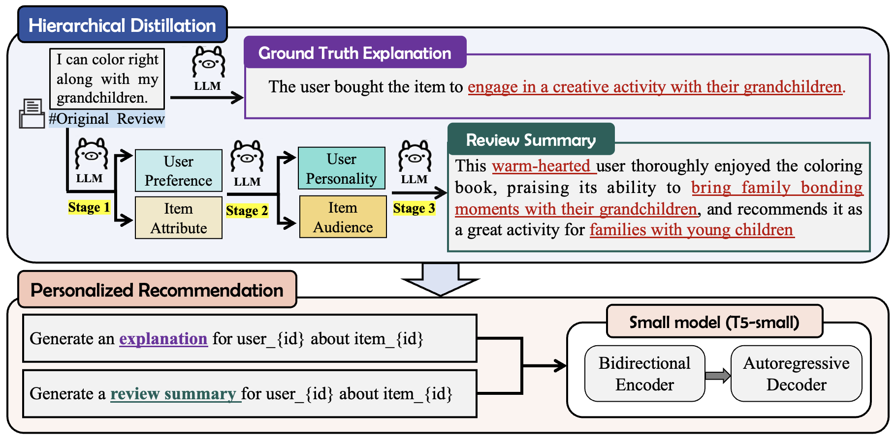

# HDRec

## Paper
- HDRec: Hierarchical Distillation for Enhanced LLM-based Recommendation Systems.
- Lingyan Zhang, Wanyu Ling, Shuwen Daizhou, and Li Kuang

## Architecture

## Instruction
### Step. 1 hierarchical distillation before pretraining

#### (a) Install llama 3（download model weights and tokenizer）
        get the License from [the site](https://llama.meta.com/llama-downloads/)
        >> cd llama 
	    >> ./download.sh (License required)
        >> pip install -e .

#### (b) Test llama 3 environment  (under ./llama )
        >> torchrun --nproc_per_node 1 example_chat_completion.py \
          --ckpt_dir llama-3-8b-instruct/ \
          --tokenizer_path tokenizer.model \
          --max_seq_len 512 --max_batch_size 6

#### (c) Hierarchical distillation  ({dataset}: beauty, sports, and toys.) (under ./HDRec )
        >> torchrun --nproc_per_node 1 data/{dataset}/distillation_{dataset}.py \
          --ckpt_dir llama/llama-3-8b-instruct/ \
          --tokenizer_path llama/tokenizer.model \
          --max_seq_len 512 --max_batch_size 6
HDRec involves multiple stages of distillation, and to obtain the final distilled information, you need to run through the entire hierarchical distillation process.

distillation\_{dataset}.py for user\_preference and item\_attribution, distillation\_{dataset}2.py for user\_personality, distillation\_{dataset}3.py for item\_audience, distillation\_{dataset}4.py for **review\_summary**, distillation\_{dataset}5.py for **groundtruth\_explanation**.

### Step. 2 train and test HDRec

#### (a) Install requirement 
        >> pip install -r requirements.txt

#### (b) Pre-training ({dataset}: beauty, sports, and toys.) (under ./HDRec )
        >> python pretrain.py --data_dir ./data/{dataset}/ --cuda --batch_size 64 --checkpoint ./checkpoint/{dataset}/

#### (c) Recommendation inference 
        >> python seq.py --data_dir ./data/{dataset}/ --cuda --batch_size 32 --checkpoint ./checkpoint/{dataset}/
        >> python topn.py --data_dir ./data/{dataset}/ --cuda --batch_size 32 --checkpoint ./checkpoint/{dataset}/
        >> python exp.py --data_dir ./data/{dataset}/ --cuda --batch_size 32 --checkpoint ./checkpoint/{dataset}/

## Others
- All experiments, including rationale distillation, can be conducted on **<u>a single Nvidia V100 GPU (32GB memory)</u>**. Reduce the batch size if **<u>CUDA out of memory</u>**.
- If you have any questions, please feel free to contact me at wanyuling@csu.edu.cn.

## Code Reference
- [RDRec](https://github.com/WangXFng/RDRec)
- [llama 3](https://github.com/meta-llama/llama3)
